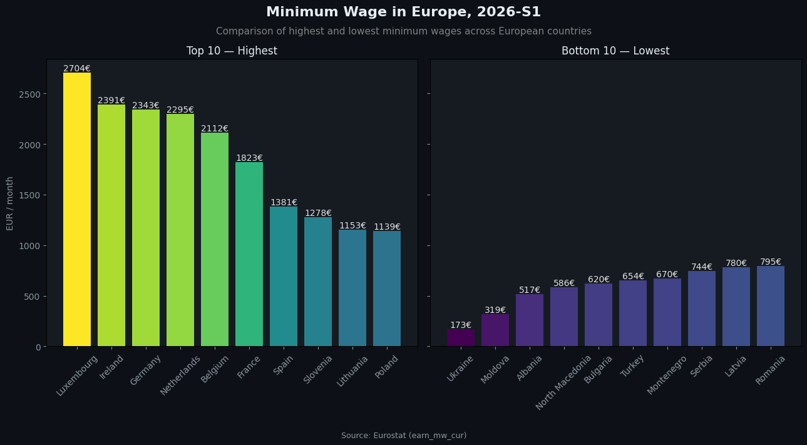
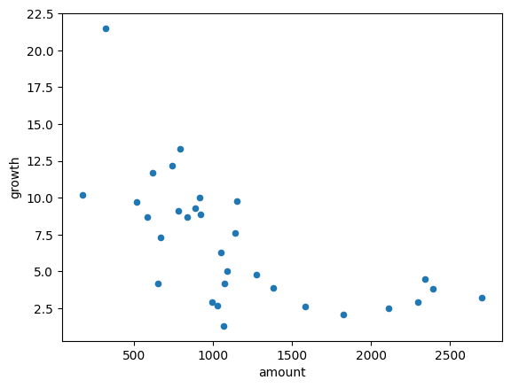
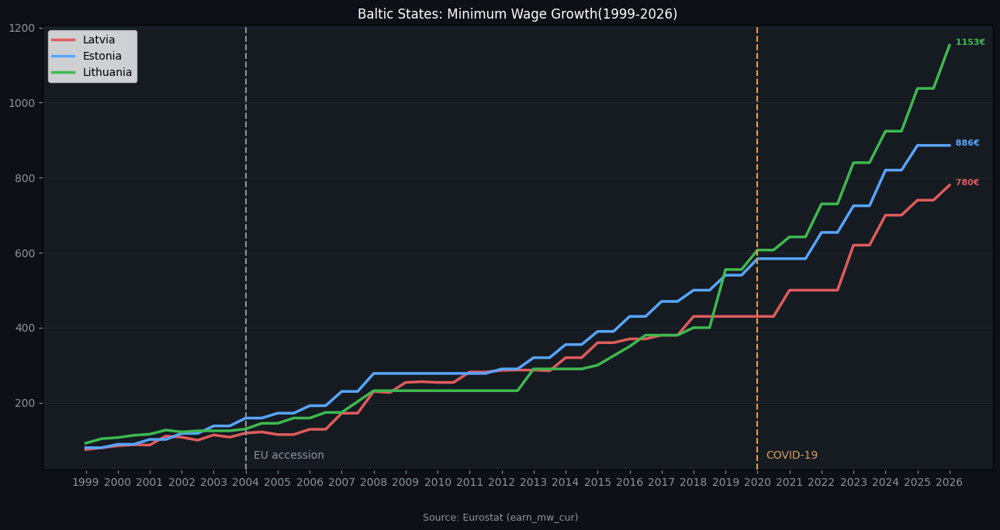
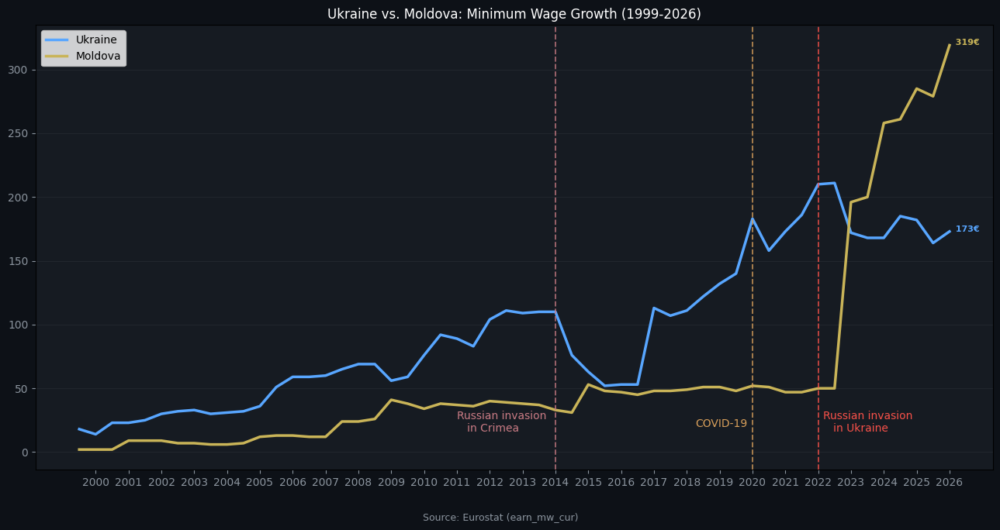

# european-minimum-wage-analysis
Exploratory analysis of minimum wages across Europe (1999–2026) using Eurostat data — pandas, matplotlib, CAGR growth rates.

Exploratory analysis of statutory minimum wages across Europe, using official Eurostat data (earn_mw_cur, 1999–2026, EUR). Built with pandas + matplotlib.

What's inside

Top 10 vs. Bottom 10 (2026) — Luxembourg leads at €2,704/month, Ukraine sits lowest at €173/month.
Growth rates (CAGR) — used compound annual growth rather than a simple percentage, since simple (last/first) growth heavily overstates growth for countries with a low starting base (e.g. Moldova started near €2/month in 1999) or short data history (Cyprus has only 7 data points vs. ~55 for most countries).
Growth vs. wage level (scatter) — shows an inverse relationship: higher current wages, slower percentage growth. Mostly arithmetic (same euro increase = bigger % on a smaller base), not necessarily catching up.
Baltic states — Latvia, Estonia, and Lithuania started from nearly the same wage in 1999, but had already diverged noticeably by 2018-2019, well before COVID.
Ukraine vs. Moldova — two post-Soviet, non-EU countries with a comparable regional and economic backdrop, though their wage levels were never identical. Their post-2022 trajectories diverge sharply: Moldova accelerates while Ukraine's euro-denominated wage plateaus.

